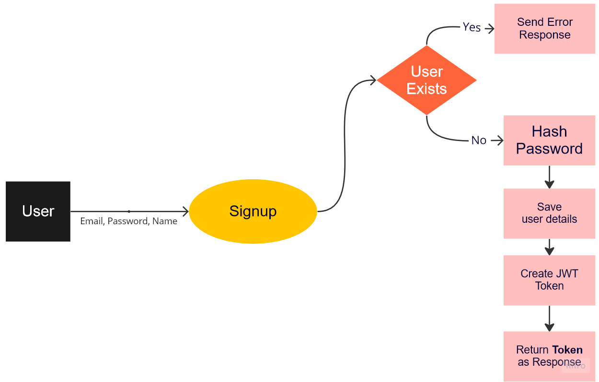

# Authentication Request Handlers

Our server is up and running. So how about we first secure our APIs.

## Route/Request Handlers

In `actix_web` every `route` needs to have a [`request handler`](https://actix.rs/actix-web/actix_web/trait.Handler.html), in the
[last section](init_api.md#creating-a-server) we created a simple `route handler` using a `closure`.
For more sophisticated handlers we can create a function and use it.

````admonish example
```rust
use actix_web;
async fn hello() -> actix_web::HttpResponse {
    HttpResponse::Ok()
        .content_type(ContentType::plaintext())
        .body("Hello World")
}

// Usage
...
.route("/hello", web::get().to(hello))
...
```
````

A `request handler` function takes any incoming data like `query params`, `AppData` and returns aything that can be converted to
`HttpResponse` and if the handler can produce errors, return signature changes.

```rust
async fn hello() -> Result<actix_web::HttpResponse, actix_web::Error> {
...
```

`actix_web` also makes it easier for us to define new routes using an `attribute macro` `route`, instead of using `.route()` we can define our routes as

```rust
#[route("/hello", method="GET")]
...
```

### Creating DTOs for request handlers

For satisfying rust's type safety, we need to create new types for incoming body for our requests such as

```json
{
  "email": "example@example.com",
  "password": "supersecureone"
}
```

these types can generally be called `DTOs` short for Data Transfer Object

So let's create them in `src/api/dtos/auth.rs`

```rust
// src/apis/dtos/auth.rs

#[derive(Debug, serde::Deserialize)]
pub struct LoginDTO {
    pub email: String,
    pub password: String,
}

#[derive(Debug, serde::Serialize, serde::Deserialize)]
pub struct LoginResponseDTO {
    pub id: String,
    pub email: String,
    pub token: String,
}

pub type SignupResponseDTO = LoginResponseDTO;

#[derive(Debug, serde::Serialize, serde::Deserialize)]
pub struct SignupRequestDTO {
    pub email: String,
    pub password: String,
    pub name: String,
}
```

`derive` is again here to help us, in addition to `Debug` we are adding `serde::Deserialze` for `LoginDTO` as we need to `deserialize` from `string` to our struct.
For our response dtos `SignupResponseDTO` and `LoginResponseDTO` we need to `serialize` them to `string` for sending response to browser.

As we have created a new directory here, owing to rust's module system, we need to create a `src/api/dtos/mod.rs` as well and then use the submodule `dtos` in our `api` module

```rust
// src/api/dtos/mod.rs
pub mod auth;
```

```rust
//src/api/mod.rs
mod dtos;
// We don't necessarily need declare dtos [pub] as we won't using it outside of api module
...
```

## Signup process

Here's an easy flowchart explaining what our signup process would look like



Few important functionalities, which are not implemented yet are **hashing password** and **creating/encoding a JWT token**

You can read more about [`JWT`](https://jwt.io), basically they are encoded strings which contain useful information about a logged
in user and helps us verify users' identity. Our client needs to store this token on login/sigup and send the token back to server
on every request containing user specific or sensitive data.

### Hashing Password

We hash passwords so that no can read the plain text version or recover the plain text from any encrypted text.

We'll be using a rust crate [`argon2`](https://docs.rs/rust-argon2/latest/argon2/) to do the hashing for us.
