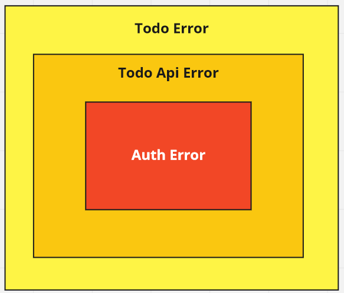

# API Errors

Before going on to create request handlers, we must consider that for any reason our APIs may produce an error, and error handling
is a big part in creating a API server. User's need to be sent relevant error messages for any errors and so does our server needs to log
required details about any particular error.

Here we will look at one approach towards handling those nifty errors.

### Structuring our API Errors

As the book's title says **Unnecessarily Complex**, we are going to make these error `enums` a little bit granular

- `AuthError` for handling **Authentication Errors** in API
- `TodoApiError` for handling all **Api Errors**
- `TodoError`, the superset for handling all the CLI's errors



Here we will implement `AuthError` and `TodoApiError` and leave `TodoError` for when we are finished with our APIs

## Error Enum for Authentication Errors

Create a new file `src/api/errors.rs`.

Now we'll create a new `enum` `AuthError` for possible Authentication errors

```rust
#[derive(Debug)]
pub enum AuthError {
    Claims(serde_json::Error),
    ///Token is invalid
    InvalidToken,
    /// Authorization header is not provided by requesting client
    NoAuthorizationHeader,
    /// Authorization header is not of the format `Bearer {token}`
    InvalidAuthorizationHeader,
    /// Jwt token expired
    TokenExpired,

    Unauthorized,

    InvalidPassword
}
```

`Claims` value is for handling `JWT` encoding, decoding errors which we look upon later, but all others are quite self explanatory. Right ?

We have our enum ready, but to render useful text from them, we need to implement [`std::fmt::Display`](https://doc.rust-lang.org/std/fmt/trait.Display.html) trait for it, which will deduce a relevant string from any `AuthError` value when converted to `String`.

```rust
impl std::fmt::Display for AuthError {
    fn fmt(&self, f: &mut std::fmt::Formatter<'_>) -> std::fmt::Result {
        match self {
            Self::InvalidAuthorizationHeader => {
                write!(f, "Authorization header is not in valid format ")
            }
            Self::InvalidPassword => {
                write!(f, "Invalid Password provided")
            }
            Self::NoAuthorizationHeader => write!(f, "No Authorization Header"),
            Self::Claims(e) => write!(f, "Error while Deserializing JWT: {}", e),
            Self::InvalidToken => write!(f, "Invalid JWT Token"),
            Self::TokenExpired => write!(f, "Token Expired"),
            Self::Unauthorized => write!(f, "Unauthorized"),
        }
    }
}
```

### Handling `jwt` errors for AuthError

Our Authentication flow required encoding and decoding `jwt` tokens, and multiple errors can
occur during this process. To handle those errors we can impl
trait [`From`](https://doc.rust-lang.org/std/convert/trait.From.html) to convert jwt errors to `AuthError`

`From` and `Into` are two traits which help in converting a value from one type to another, and requires
explicit implementation. Rust advises us to implement `From` trait instead of `Into`, but implementing
both will do the same thing.

```rust

use jsonwebtoken::errors::ErrorKind;

impl From<jsonwebtoken::errors::Error> for AuthError {
    fn from(err: jsonwebtoken::errors::Error) -> Self {
        //err.into_kind() converts error into an
        // enum which describes what kind of error occured

        // We can handle each `error_kind` individually, but for
        // now we will just handle a few
        match err.into_kind() {
            ErrorKind::ExpiredSignature => AuthError::TokenExpired,
            _ => AuthError::InvalidToken,
        }
    }
}

```

## Encompassing AuthError in TodoApiError

### Creating `TodoApiError` enum

We will create an `enum` which will represent `API` specific errors.
For this app the following one will suffice and is self decriptive.

Instead of using `std::fmt::Display` to represent `enum` value as string we are now using a new crate
`derive_more`, specifically `derive_more::Display` macro which helps us to write concise code not explicitly
impl `std::fmt::Display` trait.

```rust
#[derive(Debug, derive_more::Display)]
pub enum TodoApiError {
    #[display(fmt = "Internal Server Error")]
    InternalServerError,

    #[display(fmt = "BadRequest: {}", _0)]
    BadRequest(String),

    #[display(fmt = "Database Connection Error")]
    DatabaseConnectionError,

    #[display(fmt = "Authentication Error :{}", _0)]
    AuthError(AuthError),

    #[display(fmt = "{} Not Found", _0)]
    NotFound(String),
}
```

> `_0` represents the first argument

### Implementing `ResponseError` for TodoApiError

We need to implement `actix_web::ResponseError` for our enum so that on an error out API can return relevant
error message and status codes.

```rust
impl ResponseError for TodoApiError {
    /// Return error specific http status code
    fn status_code(&self) -> actix_web::http::StatusCode {
        match self {
            TodoApiError::InternalServerError => http::StatusCode::INTERNAL_SERVER_ERROR,
            TodoApiError::AuthError(_) => http::StatusCode::UNAUTHORIZED,
            TodoApiError::BadRequest(_) => http::StatusCode::BAD_REQUEST,
            TodoApiError::NotFound(_) => http::StatusCode::NOT_FOUND,
            _ => http::StatusCode::INTERNAL_SERVER_ERROR,
        }
    }

    /// Returns error message as an API response
    fn error_response(&self) -> HttpResponse<actix_web::body::BoxBody> {
        let mut res = HttpResponse::new(self.status_code());

        res.headers_mut().append(
            header::CONTENT_TYPE,
            HeaderValue::from_static("application/json"),
        );

        // self.to_string() here is using the derive_more::Display macro to convert
        //our enum to a string value
        res.set_body(BoxBody::new(json!({"error": self.to_string()}).to_string()))
    }
}
```

### Converting enum to HttpResponse

Now that we have implmented `ResponseError` we can create a function to return the `error_response` created
above.

```rust

impl TodoApiError {
    pub fn to_response(&self) -> HttpResponse {
        self.error_response()
    }
}

```

## Handling errors from other parts of our API

As we have handled conversion from `jwt` error to `AuthError` we can handle further
conversions for our `TodoApiError` enum for a fine grained control on our error responses

### Conversion from AuthError

Further in the book we will create utility functions to encode and decode tokens, which will return `AuthError`, rather
than handle conversion there, we can simply handle them here

```rust

impl From<AuthError> for TodoApiError {
    fn from(value: AuthError) -> Self {
        match value {
            _ => TodoApiError::AuthError(value),
        }
    }
}

```

### Conversion From r2d2 errors

We are using `r2d2` for managing our database connections, and as life tells us, `No connection is infallible`.
So let's handle that

```rust
 /// We are not delving deeper into these specific errors, rather returning `DatabaseConnectionError`
 /// for all the r2d2 errors
impl From<r2d2::Error> for TodoApiError {
    fn from(_: r2d2::Error) -> Self {
        TodoApiError::DatabaseConnectionError
    }
}

```

### Conversion from diesel errors

`diesel` can also throw different errors depending on database queries, like `ForiegnKeyViolation` or `UniqueViolation`. We
can handle some here

```rust

impl From<DBError> for TodoApiError {
    fn from(error: DBError) -> Self {
        match error {
            DBError::DatabaseError(kind, info) => {
                if let DatabaseErrorKind::UniqueViolation = kind {
                    let message: String =
                        info.details().unwrap_or_else(|| info.message()).to_string();

                    let message = format!("DatabaseError: {}", message);

                    return TodoApiError::BadRequest(message);
                }
                // On a database error, we don't necessarily need out client to know, it was
                // an error related to database
                TodoApiError::InternalServerError
            }
            _ => TodoApiError::InternalServerError,
        }
    }
}
```

> This was quite exhaustive handling errors right? Further in the book we will learn what benefits we got by doing this.
